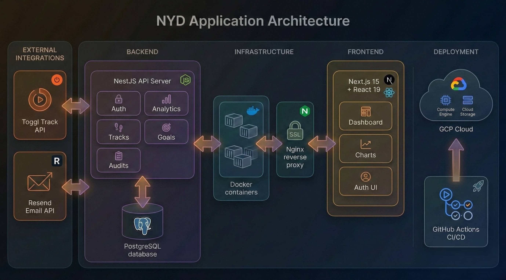

# NYD 

> A personal life operating system for measuring transformation through time awareness.

**Live Demo:** [v0.nyd.life](https://v0.nyd.life)

---

## Overview

NYD is a time tracking analytics platform that helps you understand how you spend your time. It integrates with Toggl Track to sync your time entries and provides powerful visualizations to identify patterns, track goals, and make intentional decisions about your time.

**Core Philosophy:** You can't improve what you don't measure. NYD gives you the data to answer: *Where does my time actually go?*

## Features

### Live Now

- **Dashboard & Analytics**
  - Summary statistics (total hours, sessions, averages)
  - Activity timeline with daily/weekly/monthly views
  - Project breakdown with time distribution
  - Hourly patterns to identify peak productivity hours
  - Top projects ranking

- **Toggl Track Integration**
  - Secure per-user API token storage (AES-256 encrypted)
  - One-click sync from Toggl
  - Automatic project synchronization

- **Time Period Filtering**
  - Today, This Week, This Month, All Time
  - Custom date range picker
  - Persistent preferences across sessions

- **Authentication**
  - Secure signup/login with email & password
  - Password reset via email
  - JWT-based auth with HTTP-only cookies
  - Refresh token rotation

### Coming Soon

- **Goals System** - Define identity-based goals and track progress
- **Time Awareness Audits** - Monthly audits using the Eisenhower Matrix framework
- **Quick Log** - Fast time entry without leaving the dashboard

## Tech Stack

### Backend
- **NestJS** - TypeScript framework
- **PostgreSQL** - Database
- **TypeORM** - ORM with migrations
- **JWT** - Authentication
- **Resend** - Transactional emails

### Frontend
- **Next.js 15** - React framework
- **React 19** - UI library
- **Tailwind CSS** - Styling
- **Shadcn/ui** - UI components
- **Tremor** - Analytics charts
- **SWR** - Data fetching & caching

### Infrastructure
- **Docker & Docker Compose** - Containerization
- **Nginx** - Reverse proxy with SSL
- **GitHub Actions** - CI/CD
- **GCP Compute Engine** - Hosting

## Architecture



## Getting Started

### Prerequisites

- Node.js 20+
- PostgreSQL 14+
- Toggl Track account ([get API token](https://support.toggl.com/where-is-my-api-key-located))

### Local Development

**1. Clone the repository**
```bash
git clone https://github.com/vinodvk00/nyd.git
cd nyd
```

**2. Setup Backend**
```bash
cd backend
npm install

# Create .env file
cp .env.example .env
# Edit .env with your database credentials and secrets

npm run start:dev
```

**3. Setup Frontend**
```bash
cd frontend
npm install

# Create .env.local
echo "NEXT_PUBLIC_API_URL=http://localhost:8000" > .env.local

npm run dev
```

**4. Access the app**
- Frontend: http://localhost:3000
- Backend API: http://localhost:8000

### Environment Variables

**Backend (.env)**
```env
PORT=8000
NODE_ENV=development

# Database
DB_HOST=localhost
DB_PORT=5432
DB_USERNAME=your_username
DB_PASSWORD=your_password
DB_DATABASE=nyd

# Auth
JWT_SECRET=your-secret-key
ENCRYPTION_KEY=64-char-hex-string

# Email (Resend)
RESEND_API_KEY=your-resend-key
FRONTEND_URL=http://localhost:3000
```

**Frontend (.env.local)**
```env
NEXT_PUBLIC_API_URL=http://localhost:8000
```

### Docker Deployment

```bash
# Build and run all services
docker compose up -d

# View logs
docker compose logs -f

# Rebuild after changes
docker compose build --no-cache
docker compose up -d
```

## Project Structure

```
nyd/
├── backend/                 # NestJS API
│   ├── src/
│   │   ├── auth/           # Authentication module
│   │   ├── tracks/         # Time tracking & analytics
│   │   ├── audits/         # Time awareness audits
│   │   ├── goals/          # Goals system
│   │   └── common/         # Shared services (crypto)
│   └── Dockerfile
│
├── frontend/               # Next.js app
│   ├── app/               # App router pages
│   ├── components/        # UI components
│   ├── contexts/          # React contexts
│   ├── lib/               # Utilities & API client
│   └── Dockerfile
│
├── nginx/                  # Reverse proxy config
├── docker-compose.yml      # Container orchestration
└── .github/workflows/      # CI/CD pipelines
```

## API Endpoints

### Authentication
- `POST /auth/register` - Create account
- `POST /auth/login` - Login
- `POST /auth/logout` - Logout
- `POST /auth/refresh` - Refresh tokens
- `POST /auth/forgot-password` - Request password reset
- `POST /auth/reset-password` - Reset password

### Toggl Integration
- `GET /tracks/toggl/current` - Current running task
- `POST /tracks/sync` - Sync from Toggl

### Analytics
- `GET /tracks/stats/summary` - Summary statistics
- `GET /tracks/stats/by-project` - Project breakdown
- `GET /tracks/stats/by-date` - Activity timeline
- `GET /tracks/stats/hourly-pattern` - Hourly distribution
- `GET /tracks/stats/top-projects` - Top projects

## Roadmap

### v0 (Current)
- [x] User authentication
- [x] Toggl integration with per-user tokens
- [x] Dashboard with analytics
- [x] Time period filtering
- [x] Docker deployment
- [x] CI/CD pipeline

### v1 (Next)
- [ ] Goals system completion
- [ ] Time awareness audits
- [ ] Quick log functionality
- [ ] Mobile-responsive improvements
- [ ] REWIND

### Future
- [ ] Multiple integrations
- [ ] AI-powered insights

## Contributing

1. Fork the repository
2. Create a feature branch
3. Make your changes
4. Submit a pull request

## License

MIT

---

**Built by** [@vinodvk00](https://github.com/vinodvk00)

**Try it:** [v0.nyd.life](https://v0.nyd.life)
